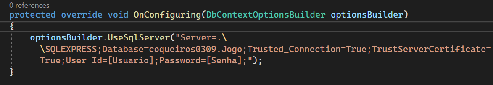

# M03S09.Jogos.WebApi
Projeto para integração com Front-end - Módulo 03 Semana 09

# 🛠️ Abrir e rodar o projeto

* Altere a conexão com o BD na classe [JogoDbContext.cs](M03S09.Jogos.WebApi/Infra/JogoDbContext.cs)




Execute o comando de update-database do EF para gerar o banco de dados no diretório [M03S09.Jogos.WebApi](M03S09.Jogos.WebApi/)

 ```
 dotnet ef database update
 ```

Rode a aplicação com o seguinte comando 

```
dotnet run 
```

 Acesso o http://localhost:54253/swagger/index.html


